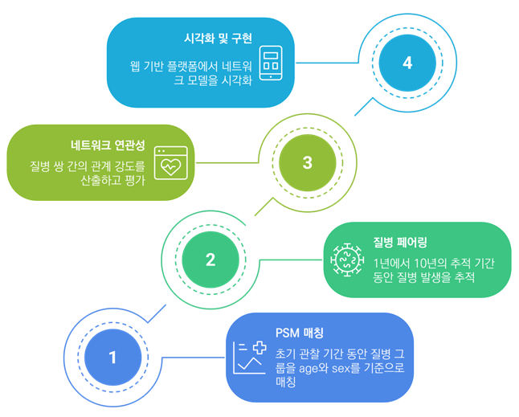

# 질병 네트워크 (CoTDeX) 프로젝트
* **보안을 위하여 해당 레포지토리에는 settings.py를 .gitignore에 포함하여 push되었습니다.**

* 한 줄 소개: 100만 명 코호트 데이터를 활용, 시간의 흐름에 따른 질병 관계 변화를 분석하고 탐색하는 동적 네트워크 시각화 플랫폼을 구축한 End-to-End 데이터 과학 프로젝트
* 진행 및 참여기간: 2025/07/18 → 2025/07/18
* 담당 부분: End-to-End 데이터 과학, 네트워크 분석, 대규모 데이터 처리, 시각화 플랫폼 개발
* 분야: 네트워크 분석, 데이터 시각화, 웹 개발, 의료 빅데이터
* 성과 요약: CoTDeX 플랫폼 개발, 동적 질병 네트워크 DB 구축, 학회 구연 발표
* 적용 skill 및 tools: Cytoscape.js, Django, Maria DB, SAS, SQL, multiprocessing, networkx, python

## 📖 내용 요약

1. **프로젝트 진행 흐름**

1. **네트워크 분석 시각화**

1. **웹 플랫폼 프로토타입**

---

## 🧶 프로젝트 배경

기존 질병 네트워크 연구는 특정 시점의 관계만을 보여주는 정적(Static) 분석에 머무르는 한계가 있었습니다. 이에 **100만 명 규모의 국민건강보험공단 코호트 데이터**를 활용하여, 10년의 시간 흐름에 따른 질병 간 상호 관계의 **동적(Dynamic) 변화를 추적하고 시각적으로 탐색**할 수 있는 플랫폼 'CoTDeX'를 구축하는 본 연구 개발 프로젝트를 수행했습니다.

---

## 🔍 문제 정의

- **대규모 데이터 처리의 복잡성**
    
    100만 명의 10년치 상병 기록(Raw Data)을 처리하고, 선별한 1,187개 질병 각각에 대해 통계적 신뢰도를 확보하기 위한 **1:5 성별/연령 매칭 코호트를 생성**하는 과정은 상당한 컴퓨팅 자원과 정교한 데이터 엔지니어링을 요구했습니다.
    
- **천문학적 계산량과 성능 문제**
    
    약 140만 개에 달하는 질병 쌍에 대해 10개년 각각의 상대위험도(RR)를 계산하여 최종적으로 **4,800만 행(row)에 달하는 통계 데이터를 생성**하는 작업은, 단일 프로세스로는 수개월이 소요될 수 있는 대규모 연산 문제였습니다.
    
- **분석 결과의 해석 및 활용의 어려움**
    
    수백만 개의 노드와 엣지로 구성된 Raw Network 데이터는 그 자체로는 의미를 파악하기 어렵습니다. 연구자들이 직관적으로 인사이트를 발견하고 가설을 검증할 수 있도록 돕는 **효과적인 시각화 및 탐색 도구가** 필요했습니다.
    

---

## 🔧 문제 해결 방식

- **SAS/SQL 기반 대규모 데이터 전처리 파이프라인 구축**
    
     `SAS`와 `SQL`을 활용하여 100만 명 코호트의 원시 데이터를 정제하고, 각 질병에 대한 1:5 매칭 코호트를 생성하는 등 통계 분석에 적합한 형태의 데이터셋을 구축하는 **초기 ETL 파이프라인을 설계**했습니다.
    
- **병렬 처리를 통한 연산 성능 최적화**
    
    주어진 단일 서버 환경의 한계 내에서 수개월이 소요될 수 있는 140만 쌍의 상대위험도 계산 문제를 해결하기 위해, `Python`의 `multiprocessing` 라이브러리를 적용했습니다. **연산 작업을 병렬화하여 자원 활용을 극대화**함으로써 전체 분석 시간을 획기적으로 단축했습니다.
    
- **네트워크 과학 기반의 구조적 특성 분석**
    
    `networkx` 라이브러리를 활용하여 연도별 질병 네트워크를 생성하고, 연결성, 밀도, 클러스터링 계수 등 **다양한 정량적 지표를 추출하여 시간의 흐름에 따른 네트워크의 구조적 진화 과정을 분석**했습니다.
    
- **MariaDB 구축 및 Django 기반 웹 시각화 프로토타입 개발**
    
    분석된 네트워크 데이터를 `MariaDB`에 이관하여 데이터베이스를 구축하고, `Django`를 통해 API를 개발했습니다. 최종적으로 사용자가 직접 질병 네트워크를 탐색할 수 있는 **웹 기반 시각화 프로토타입 'CoTDeX'를 구현**하여 학회에서 시연했습니다.
    

---

## 📄 결과

- **4,800만 건 규모의 동적 질병 네트워크 데이터 자산 구축**
    
    100만 명 코호트 기반, 1,187개 질병의 10년간 상호 관계 변화를 상대위험도(RR)로 정량화한 **총 4,800만 행 규모의 동적 질병 네트워크 데이터베이스를 성공적으로 구축**했습니다.
    
- **네트워크 분석 기반의 새로운 의학적 인사이트 도출**
    
    네트워크 구조 분석을 통해, 시간이 지남에 따라 질병 네트워크가 특정 질병 중심의 구조에서 점차 분산형으로 진화하는 패턴을 정량적으로 규명하는 등 **새로운 의학적, 역학적 인사이트를 도출**했습니다.
    
- **대한의료정보학회(KOSMI) 구연 발표 선정 및 기술력 입증**
    
    프로젝트의 전 과정과 분석 결과, 그리고 웹 시각화 프로토타입(CoTDeX)의 우수성을 인정받아 **2025년 춘계 대한의료정보학회에서 구연 발표 대상으로 선정**되어, 연구의 학술적 가치와 기술적 완성도를 공식적으로 입증했습니다.
    

---

## 🛠️ 적용 skills 및 tools

- **Data Processing & Engineering:** `Python`, `SAS`, `SQL`, `MariaDB`, `pandas`, `multiprocessing`
- **Data Science & Analysis:** `Network Analysis (networkx)`, `Statistics (Relative Risk)`, `R`
- **Web Development & Visualization:** `Django`, `Cytoscape.js`

---

## 💡 후기

- **데이터 과학의 전 과정을 아우르는 통합적 역량 성장**
    
    대규모 원시 데이터 정제부터 통계 분석, 네트워크 모델링, DB 구축, 그리고 최종 서비스 프로토타입 개발까지, **데이터가 아이디어에서 출발하여 실제 가치를 지닌 결과물로 완성되는 전 과정을 주도적으로 경험**하며 데이터 과학자로서의 통합적인 시야와 역량을 기를 수 있었습니다.
    
- **주어진 환경 내에서 문제를 해결하는 엔지니어링 역량**
    
    분산 처리 환경이 아닌 단일 서버의 제약 속에서 대규모 연산 문제를 해결하기 위해 병렬 처리 기법을 적용하며, **문제의 본질을 파악하고 주어진 환경에 맞는 최적의 기술을 선택하는 실용적인 문제 해결 능력**을 길렀습니다. 이 경험을 통해 어떤 환경에서도 데이터 기반의 문제를 해결할 수 있다는 자신감을 얻었습니다.
    

---

## 🔗 관련 링크

- https://www.kosmi.org/bbs/view_image.php?fn=%2Fdata%2Feditor%2F2507%2F95ae1abe352f9a059d1ff858bc9888cc_1751338873_4212.jpg : 자유연제 10

# 질병 네트워크 분석 및 시각화 시스템 개발 보고서

## 1. 연구 개요

본 보고서는 국민건강보험공단(NHIS)의 표본 코호트 데이터를 기반으로 하여 질병 간 시간적 연관성과 구조적 특성을 분석하고, 이를 시각화하는 웹 기반 질병 네트워크 시스템(CoTDeX)을 구축한 전 과정을 정리한 것입니다.

본 연구는 2003년 기준으로 전체 질병에 대해 1:5 Propensity Score Matching(PSM)을 수행하여 개별 코호트를 구성하고, 각 질병쌍 간 상대위험도(Relative Risk; RR)를 기반으로 연도별 질병 네트워크를 구축하는 것을 목표로 합니다. 이후, 각 네트워크에 대해 구조적 특성 지표를 분석하고 웹 시각화 시스템에 탑재하였습니다.

## 2. 전처리 및 코호트 구성 (SAS)

- 2003년 기준 NHIS 자격 보유 인구를 초기 분석 대상으로 설정
- 2002~2013년의 상병 기록(KCD-6 기준)을 통합하여 질병 진단 이력 구축
- 2002년 진단 이력을 워시아웃(washout)하여 2003년 최초 발생 질병만 유지
- 10건 이상 발생한 1,187개 질병만 선별
- 각 질병에 대해 age_group, sex 기준으로 1:5 exact matching 수행 → matched cohort 생성
- 각 cohort에 대해 follow-up 기간(1~10년) 내 질병 발생 정보 구성

## 3. Contingency Table 생성 (`ctable_generator_20250612.ipynb`)

- 각 질병코드에 대해 matched cohort 데이터를 기반으로
- follow-up 기간 내 outcome 질병 발생 여부를 기준으로 2×2 contingency table 구성
- case/control 그룹 내 outcome 발생 여부 집계 (a, b, c, d 값)

## 4. 상대위험도 및 통계량 계산 (`rr_calculator_20250611.ipynb`)

- 생성된 contingency table을 기반으로 RR, log(RR), 95% CI, p-value, Fisher's p-value 계산
- R `epitools` 패키지를 연동하여 RR 계산 수행
- 계산된 결과를 하나의 RR 테이블(csv)로 저장

## 5. 네트워크 구성 정보 생성 (`node_edge_info_generator_20250617.ipynb`)

- RR 결과를 기반으로 edge 목록 구성 (cause → outcome, log(RR) 포함)
- 노드 정보에는 질병명, 발생 수, 코드 등 포함
- 최종적으로 node/edge csv 파일 생성 → 웹 시각화 입력 데이터

## 6. 부가 정보 병합 (`info_merging_20250617.ipynb`)

- 노드에 성별, 연령대, 지역별 분포 정보 통합
- 엣지에는 case/control 수, 질병명, RR 등 추가 속성 병합
- 시각화 및 필터링 기능을 위한 확장된 attribute 테이블 생성

## 7. 데이터베이스 마이그레이션 (`latte_migration.ipynb`)

- 생성된 node/edge DataFrame을 MariaDB에 업로드
- 테이블명: `cotdex_nodes`, `cotdex_edges`
- Django 백엔드에서 쿼리로 접근 가능하도록 설계

## 8. 네트워크 구조 특성 분석 (`network_feature_extraction_20250620.ipynb`)

- 연도별 네트워크 데이터를 기반으로 다음 지표 계산:
    - 평균 degree/strength
    - network density
    - power-law 적합성
    - modularity 및 connected component 분석
- 연도별 지표 변화를 통해 네트워크 진화 분석

## 9. 결론 및 활용

본 프로젝트는 정적 질병 네트워크의 한계를 극복하고, 시간의 흐름에 따른 질병 간 연관 구조 변화를 정량적으로 분석하고 시각화할 수 있는 시스템을 구축하였다. 주요 결과는 다음과 같습니다다:

- PSM 기반 개별 질병 코호트 구성 및 1~10년 추적 질병 데이터 구축
- 연도별 RR 기반 directed weighted disease network 생성
- 질병 간 구조적 연결성, 중심 질병군, 클러스터 분석 수행
- 사용자 조건 기반 탐색 가능한 웹 시각화 도구 구현